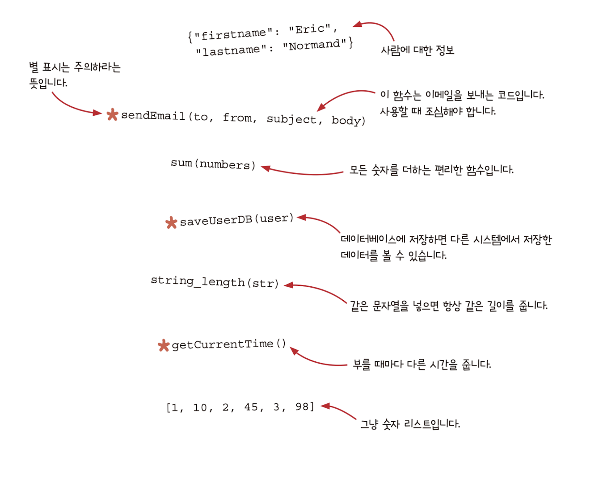
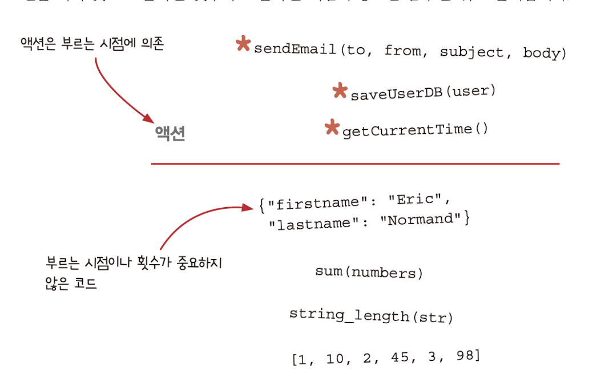
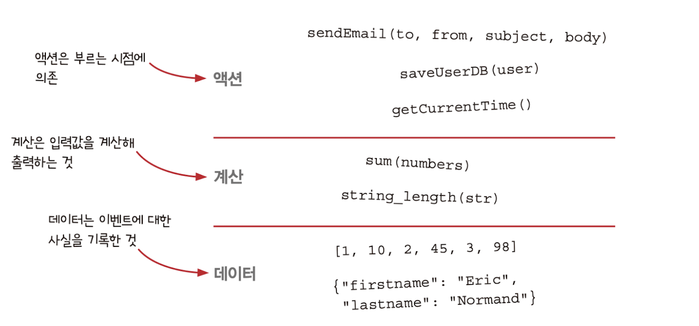

# 함수형 프로그래밍은 무엇인가요?

- 함수형 프로그래밍(Funcional Programming)
  - *수학 함수*를 사용하고 _부수 효과(side Effect)_ 를 피하는 것이 특징인 프로그래밍 패러다임
  - _부수효과_ 없이 _순수함수_ 만 사용하는 프로그래밍 스타일

### 여기서 말하는 '부수 효과(side Effect)'란?

함수가 return값 이외에 하는 모든 일을 일컫습니다.

부수 효과의 예시

- 이메일 보내기
- 파일 읽기
- 웹 요청 하기 등등

### 여기서 말하는 '순수 함수'란?

**인자에만 의존** 하고 부수 효과가 없는 함수.

인자에만 의존? => 같은 인자를 넣는다면 항상 같은 결과를 돌려준다. 라는 말입니다.

 
 

# 실용적인 측면에서 함수형 프로그래밍 정의의 문제점

### 문제 1. 부수 효과는 필요합니다

함수형 프로그래밍에서는 부수 효과(side effect)를 피해야하지만 프로그래밍에서 부수효과는 소프트웨어를 실행하는 이유입니다.
즉, 꼭 필요할 때는 사용을 해야합니다.

### 문제 2. 함수형 프로그래밍은 부수 효과를 잘 다룰 수 있다.

1번과 같은 문제점을 알고 있기에 함수형 프로그래머는 부수 효과를 잘 다루기 위해 노력하며 그에 해당하는 도구를 잘 알고있습니다.
함수형 프로그래머는 순수하지 않는 함수를 사용하기도 하며, 이런 비순수 함수를 사용하기 위해 많은 기술이 존재합니다.

### 문제 3. 함수형 프로그래밍은 실용적이다.

함수형 프로그래밍은 실제 소프트웨어 개발에서 사용하지 않을 것처럼 느껴집니다.
고로 프로그래밍을 시작하려는 사람에게는 높은 허들이 될 수 있습니다.

 
 

# 함수형 프로그래밍 정의가 혼란스러운 관리자

</img>

 
 

# 함수형 프로그래밍을 학문적 지식이 아닌 기술과 개념으로 보기

위와 같은 문제와 같이 함수형 프로그래밍 정의는 사람마다 다른 의미를 생각하고 또한 존재합니다.

이 책에서는 일반적인 함수형 프로그래밍 정의를 사용하기보다 실제 함수형 프로그래밍을 사용하는 사용하는 프로그래머가 가진 기술, 생각의 흐름, 시각을 정리하며 활용합니다.

 
 

# 액션과 계산, 데이터 구분하기

함수형 프로그래머들이 항상 말하는 액션(action), 계산(calculation), 데이터(data)를 알아봅시다.

이미지에서 별 표시가 있는 코드를 **'액션'** 이라고 생각합니다.

</img>

# 함수형 프로그래머는 부를 때 조심해야 하는 코드를 구분합니다.

</img>

이처럼 선을 기준으로 위쪽의 코드는 부르는 시점(호출하는 시점)에 의존하며 호출할 때 항상 조심해야합니다.

하지만 아래쪽의 코드는 어디에서 호출을 해도 항상 같은 값을 출력하기 때문에 호출횟수나 위치가 상관이 없습니다.

 
 

# 함수형 프로그래머는 실행하는 코드와 그렇지 않은 코드를 구분합니다.

좀 더 세밀하게 분류해보겠습니다

</img>

나눈 기준은 호출 가능 여부로 나누었습니다.

- **계산** 과 **데이터** 칸에 차이는 실행하는지 여부에 있습니다. **계산** 은 실행이 가능하지만 **데이터는** 정적이며 실행할 수 없습니다.
- 계산은 실행하기 전까지 어떻게 동작하는지 알 수 없습니다.

 

> 이처럼 액션, 계산, 데이터를 구분하는 것이 함수형 프로그래밍에서 기본 개념입니다.

그리고 함수형 프로그래머는 액션보단 계산을 좋아하며 , 계산 보단 데이터를 좋아합니다. 사용함에 있어 쉽다고 느끼는 이유가 있습니다.

# 함수형 프로그래머는 액션과 계산, 데이터를 구분합니다.

클라이두 서비스를 만든다고 예시를 들겠습니다. 아래의 시나리오에서 액션, 계산, 데이터를 구분해보겠습니다.

1. 사용자가 작업 완료 표시를 함
   1. UI이벤트에 해당하며 실행 횟수에 의존하기에 **'액션'** 입니다.
2. 클라이언트가 서버로 메세지를 보냄
   1. 메세지를 보내는 것이기에 **'액션'** 에 해당합니다.
   2. 나중에 서버에서 해석해야 하는 값이 있기에 **'데이터'** 도 해당됩니다.
3. 서버가 메세지를 받음
   1. 메세지를 받는 것은 횟수에 의존하기에 **'액션'** 입니다.
4. 서버가 데이터베이스를 변경
   1. 내부 상태를 변경하는 것은 **'액션'** 입니다.
5. 서버가 누구에게 알림을 보낼지 결정
   1. 결정하는 것은 **'계산'** 입니다. 입력갑시 같다면 서버는 항상 같은 결정을 내리기 때문
6. 서버가 이메일로 알림을 보냄
   1. 이메일 보내기는 **'액션'** 입니다. 같은 메일을 한 번 보내는 것과 두번 보내는 것은 다르기 때문입니다.

 
 

# 함수형 프로그래밍에서는 코드를 세 가지로 구분합니다.

1. 액션

**실행 시점이나 횟수 또는 둘 다에 의존합니다.**

- 시간에 지남에 따라 상태를 바꿀 수 있는 방법
- 순서를 보장하는 방법
- 액션이 정확히 한 번만 실행되게 보장하는 방법

2. 계산

입력값으로 출력값을 만드는 것입니다.

언제 어디서든 계산을 하여도 결과는 같아야하며 외부에 영향을 주지 않습니다.

계산은 테스트하기 쉽고 언제든지 불러도 안전합니다.

- 정확성을 위한 정적 분석
- 소프트웨어에서 쓸 수 있는수학적 지식
- 테스트 전략

3. 데이터

**이벤트에 대해 기록한 사실**입니다.

데이터는 실행하는 코드만큼 복잡하지 않기 때문에 다른 것과 구분되지 않습니다.

알아보기 쉬운 속성으로 되어 있으며 데이터 자체로 의미가 있습니다.

- 효율적으로 접근하기위해 데이터를 구성하는 방법
- 데이터를 보관하기 위한 기술
- 데이터를 이용해 중요한 것을 발견하는 원칙

 
 

# 액션, 계산, 데이터를 구분하면 어떤 장점이 있나요?

# 다른 함수형 프로그래밍 책과 다른 점

# 함수형 사고가 무엇인가요?

# 이 책을 읽는 기본 규칙

# 결론
